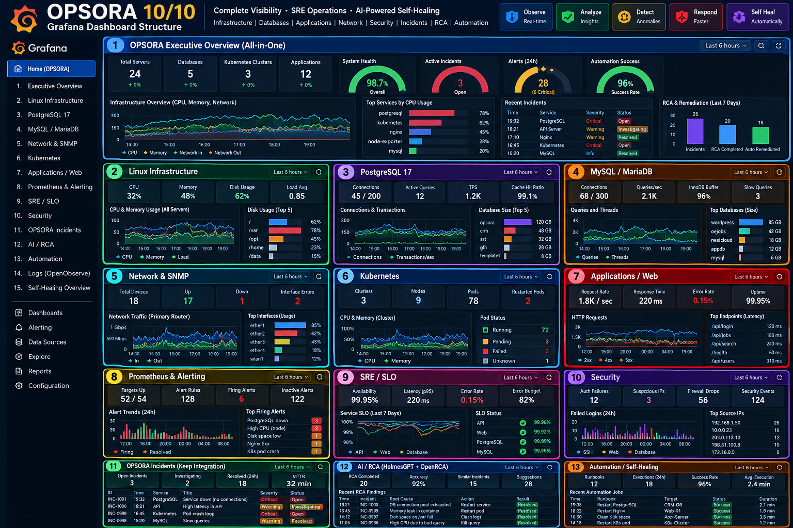

# AIOps · AI-SRE · AI Incident Management

An integrated observability and site reliability engineering (SRE) platform designed to support infrastructure monitoring, incident detection, troubleshooting, and operational visibility using OpenObserve and AI-assisted workflows.

## 🚀 Overview

This repository provides installation scripts, architecture diagrams, and operational documentation for building an observability and incident-management environment.

### Key capabilities

- 📊 **Observability dashboards** — centralized visibility into system and service health
- 📈 **Metrics, logs, and traces** — support for operational troubleshooting and analysis
- 🚨 **Incident management** — foundations for alerting, incident investigation, and response workflows
- 🤖 **AI-assisted operations** — a foundation for integrating AI into SRE workflows
- 🔧 **Automated installation** — shell scripts for deploying the platform
- 🔐 **Access control** — options for LAN-oriented access and secure management

## 🏗️ Architecture and Workflow

The repository includes architecture and workflow diagrams illustrating the intended platform design.

### Platform architecture


### End-to-end operations workflow


### Observability dashboard



### SRE observability architecture guide

See `OPSORA SRE Observability Architecture Guide...png` in the repository for the detailed architecture reference.

## 📋 Repository Contents

| File | Purpose |
|---|---|
| `opsora-install.sh` | Main platform installation script |
| `install-openobserve.sh` | OpenObserve installation component |
| `readme.md` | Installation and usage instructions |
| `OPSORA 10 10 Observability Dashboard.png` | Dashboard reference |
| `OPSORA End-to-End Operations Flow.png` | End-to-end workflow diagram |
| `OPSORA SRE Platform Architecture Flow.png` | Platform architecture diagram |
| `OPSORA SRE Observability Architecture Guide...png` | Observability architecture reference |

## 🛠️ Requirements

- Ubuntu Linux server
- Root or `sudo` privileges
- Internet connectivity
- Sufficient CPU, RAM, and storage for the expected workload
- Network access to the management interface
- Firewall configuration appropriate for your environment

Actual resource requirements depend on ingestion volume, retention, and the components enabled by the installer.

## 📥 Installation

### 1. Update the system

```bash
sudo apt-get update
sudo apt-get -y upgrade
sudo reboot
```

Reconnect to the server after it restarts.

### 2. Download the repository

```bash
sudo apt-get install -y git curl
git clone https://github.com/redhatmurali/AIOps-AI-SRE-AI-Incident-Management-.git
cd AIOps-AI-SRE-AI-Incident-Management-
```

### 3. Review the installation scripts

```bash
less opsora-install.sh
less install-openobserve.sh
```

Review the scripts before running them with elevated privileges.

### 4. Install the platform

For LAN-oriented access, the repository's documented command is:

```bash
sudo LAN_ACCESS=true bash opsora-install.sh
```

Follow any prompts displayed by the installer.

### 5. Configure credentials

The repository's documented command is:

```bash
sudo opsora-credentials
```

Use the credentials and management URL generated by the installation process.

### 6. Check the OpenObserve URL

The repository indicates that the installation configuration is stored at:

```bash
sudo grep OPENOBSERVE_URL /opt/opsora/config/install.env
```

Use the URL reported by the installation rather than assuming a fixed address or port.

## 🔍 Operational Verification

After installation, verify that the relevant services are running and that the dashboard is reachable from an authorized client.

```bash
systemctl --failed
```

If the installation uses Docker containers, inspect their status using:

```bash
sudo docker ps
```

Use the commands appropriate to the services installed by the script.

## 🔐 Security Recommendations

- Restrict management interfaces to trusted LANs or VPN-free private networks as appropriate for your deployment.
- Do not expose observability interfaces directly to the public Internet without proper access controls.
- Change default credentials immediately.
- Use HTTPS for remote management.
- Protect API keys, passwords, and configuration files.
- Configure backups and data-retention policies.
- Review firewall rules and exposed ports before production use.

## 📚 Documentation and Diagrams

Browse the repository for architecture diagrams, workflow references, and installation scripts.

**Repository:** [AIOps-AI-SRE-AI-Incident-Management](https://github.com/redhatmurali/AIOps-AI-SRE-AI-Incident-Management-)

## ⚠️ Project Status

This repository provides installation scripts and architecture references. The actual features available depend on the installed components and their configuration. AI-driven remediation, automated incident resolution, and integrations should be considered available only after they have been implemented and tested.

## 📄 License

Add a `LICENSE` file if you intend to distribute this project for reuse.
